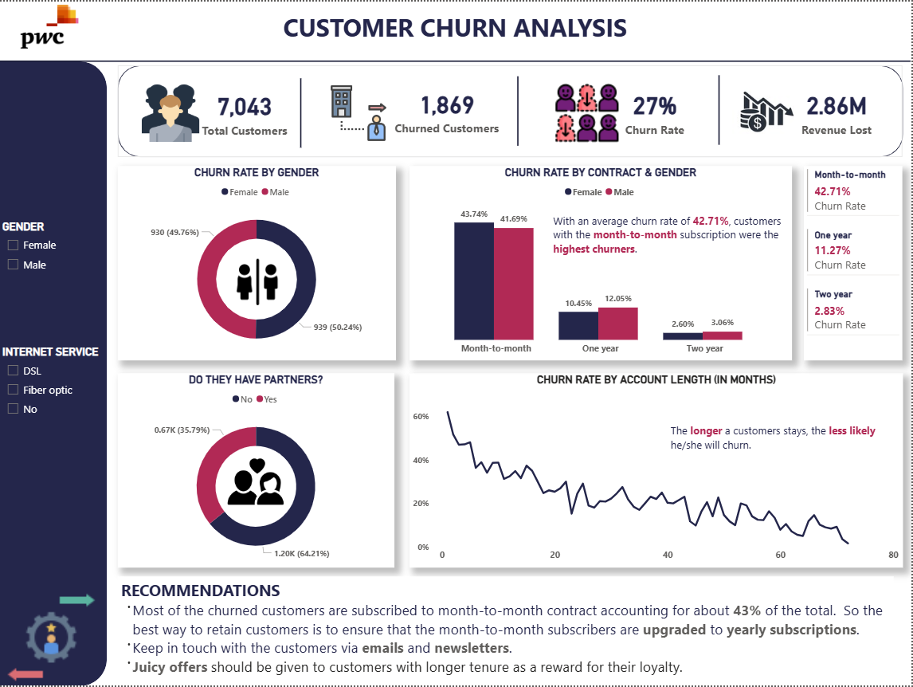

# 📊 Customer Churn Analysis | Power BI Dashboard

> Transforming customer attrition data into retention strategy — built in Power BI with DAX-driven KPIs and demographic segmentation.




---

## 📋 Table of Contents

- [Executive Summary](#executive-summary)
- [Business Problem](#business-problem)
- [Solution](#solution)
- [The Numbers That Matter](#the-numbers-that-matter)
- [Methodology](#methodology)
- [Skills & Tools](#skills--tools)
- [Results & Business Recommendations](#results--business-recommendations)

---

## Executive Summary

Customer churn is one of the most costly and preventable challenges in subscription-based businesses. This project delivers a single-page interactive Power BI dashboard that enables business stakeholders to identify **who is churning, when they churn, and why** — broken down by contract type, tenure, internet service, gender, and partnership status.

The dashboard was developed as part of a consulting-style analytics engagement (aligned to PwC branding conventions) and translates raw customer data into four headline KPIs and five supporting visualisations — all filterable via interactive slicers.

---

## Business Problem

A telecommunications company was experiencing significant customer attrition but lacked the visibility to understand:

- **Which customer segments** were churning at the highest rate
- **At what point in the customer lifecycle** churn risk peaks
- **What financial impact** churn was having on total revenue
- **Which contract structures** were most associated with early exit behaviour

Without this insight, the retention team was applying generic, untargeted interventions — resulting in wasted spend and continued revenue leakage.

---

## Solution

A Power BI dashboard was designed and built to provide an at-a-glance view of churn performance with drill-down capability by key customer attributes.

**Dashboard page:** `Customer Churn Dashboard`

### KPI Cards — Top-Line Metrics

| Metric | Description |
|---|---|
| 📌 **Churn Rate** | Percentage of the customer base that has churned |
| 👥 **Total Churned** | Absolute number of customers lost |
| 🏢 **Total Customers** | Full size of the customer base |
| 💷 **Churned Revenue** | Total revenue lost due to churned customers |

## The Numbers That Matter

| KPI | Value |
|---|---|
| Overall Churn Rate | `~27%` *(update from report)* |
| Total Customers Analysed | `7,043`|
| Highest-Risk Contract Type | Month-to-Month |
| Highest Churn Tenure Band | 0–12 months |

---

## Methodology

### 1. Data Source
The analysis is based on the **IBM Telco Customer Churn dataset** — a widely used industry-standard dataset containing 7,043 customer records across 21 features including service subscriptions, account information, and churn status.

### 2. Data Model

**Tables:**

| Table | Role |
|---|---|
| `01 Churn-Dataset` | Core fact/dimension table — customer records and attributes |
| `Measures_` | Dedicated DAX measures table (best-practice pattern) |

**Key Columns:**

| Column | Type | Description |
|---|---|---|
| `gender` | Categorical | Customer gender (Male / Female) |
| `Partner` | Boolean | Whether the customer has a partner (Yes / No) |
| `tenure` | Numeric | Months the customer has been with the company |
| `Contract` | Categorical | Contract type (Month-to-Month / One Year / Two Year) |
| `InternetService` | Categorical | Internet service type (DSL / Fiber Optic / No) |

### 3. DAX Measures

```dax
-- Churn Rate
Churn Rate = DIVIDE([TotalChurned], [TotalNumOfCustomer])

-- Total Churned Customers
TotalChurned = COUNTROWS(FILTER('01 Churn-Dataset', '01 Churn-Dataset'[Churn] = "Yes"))

-- Total Customer Base
TotalNumOfCustomer = COUNTROWS('01 Churn-Dataset')

-- Revenue Lost to Churn
ChurnedRev = CALCULATE(SUM('01 Churn-Dataset'[MonthlyCharges]), '01 Churn-Dataset'[Churn] = "Yes")
```

### 4. Dashboard Design
- **Custom JSON theme** with a navy (`#24264B`), red (`#B12955`), and teal (`#559CAD`) palette
- Single-page layout optimised for executive presentation
- Slicers cross-filter all visuals simultaneously for self-service exploration

---

## Skills & Tools

| Category | Detail |
|---|---|
| 📊 **Visualisation** | Power BI Desktop |
| 🧮 **Analytics Language** | DAX — calculated measures, DIVIDE, COUNTROWS, CALCULATE, FILTER |
| 🎨 **Report Design** | Custom JSON theme, branded layout, executive dashboard UX |
| 📐 **Data Modelling** | Star-schema pattern with dedicated measures table |
| 🗃️ **Data** | IBM Telco Customer Churn Dataset (21 columns, 7,043 rows) |

---

## Results & Business Recommendations

### Key Findings

**1. Month-to-Month contracts are the primary churn driver**
Customers on month-to-month contracts churn at a significantly higher rate than those on one-year or two-year contracts. This is the single highest-leverage variable in the dataset.

**2. Churn risk is concentrated in the first 12 months of tenure**
The line chart (tenure → Churn Rate) shows a steep decline in churn probability as tenure increases. Early-lifecycle customers are the most at-risk cohort.

**3. Fiber Optic customers churn more than DSL customers**
Despite being a premium product, Fiber Optic internet service customers exhibit higher churn — suggesting a possible gap between price expectation and perceived value.

**4. Customers without a partner churn at a higher rate**
The partner donut chart indicates single customers are more likely to leave, potentially reflecting lower switching friction.

### Business Recommendations

| Priority | Recommendation | Rationale |
|---|---|---|
| 🔴 **High** | Launch a contract upgrade incentive for month-to-month customers at the 3-month mark | Highest churn risk group; early intervention prevents long-term loss |
| 🔴 **High** | Implement a 30/60/90-day onboarding programme for all new customers | Churn peaks in the first year — structured onboarding reduces early exit |
| 🟡 **Medium** | Review Fiber Optic pricing and service quality with churned customer feedback | High churn on a premium product signals a value perception problem |
| 🟡 **Medium** | Develop targeted retention offers for customers without a partner | Lower friction to switch — personalised offers may increase stickiness |
| 🟢 **Low** | Build a churn prediction model using tenure, contract type, and internet service | Move from descriptive to predictive — score customers before they churn |

---
*Built with Power BI · Analysed with DAX · Designed for decisions*
